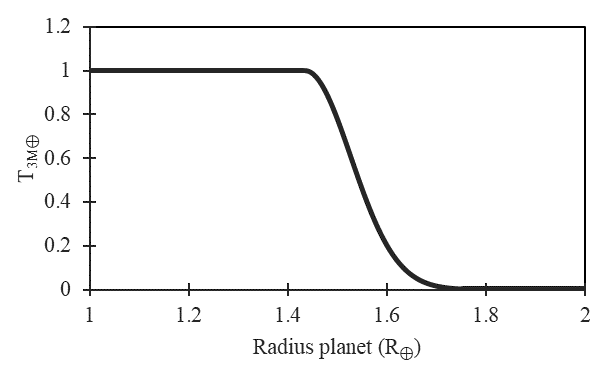
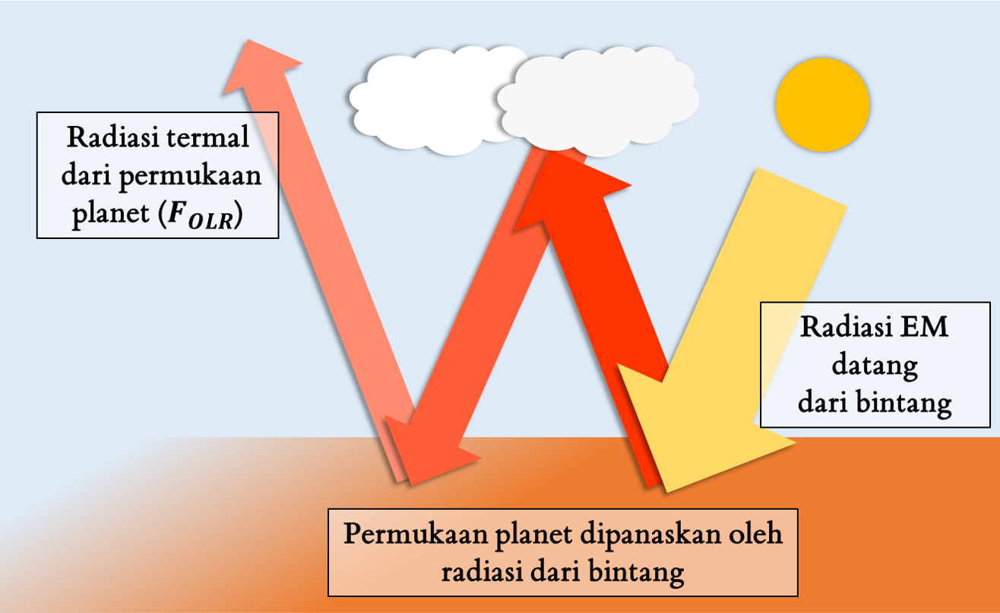
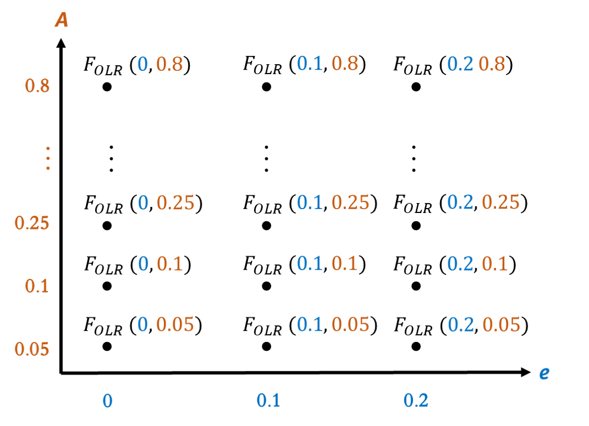
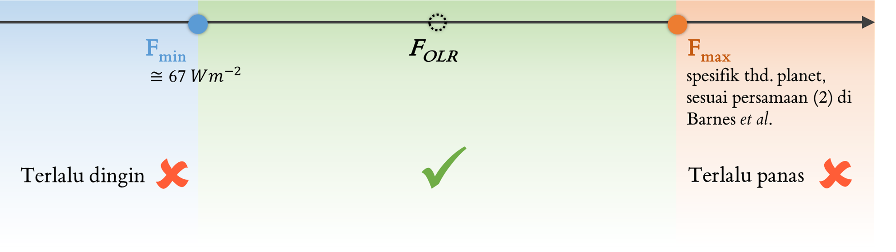
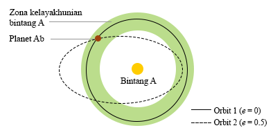

# Perincian Algoritma
Laman ini memuat perincian algoritma yang dipakai dalam menentukan nilai indeks HITE bagi suatu eksoplanet, serta modifikasi yang dilakukan terhadap algoritma tersebut sehingga menjadi HITE termodifikasi (M-HITE)

$$\begin{align}
p_{ter}(r)=
\begin{cases}
0, & r \leq 1.5 \\
(2.5-r), & 1.5 < r < 2.5 \\
1, & r \geq 2.5.
\end{cases}
\end{align}$$

## Asumsi
### Definisi ‘Layak Huni’
Definisi ‘layak huni bagi makhluk hidup’ tentu bergantung pada definisi makhluk hidup itu sendiri. Perlu diingat bahwa kehidupan di planet lain, jika ada, tentu saja bisa memiliki proses-proses biokimia yang berbeda jauh dengan kehidupan yang kita ketahui—sesuatu yang sulit dibayangkan karena contoh bentuk kehidupan yang kita ketahui saat ini baru satu, yaitu kehidupan di Bumi.

Upaya untuk membayangkan bentuk kehidupan alternatif seperti itu merupakan bidang penelitiannya sendiri. Karena itu, teks ini akan menggunakan definisi makhluk hidup yang cenderung sederhana, yaitu organisme dengan karakteristik yang kurang lebih mirip dengan yang ada di Bumi: **berbasis senyawa karbon** dan **membutuhkan air**. Fokusnya terutama diberikan pada organisme sederhana yang relatif tahan banting seperti **bakteri bersel satu**.

Asumsi lain yang berkaitan adalah bahwa makhluk hidup ini membutuhkan lingkungan yang relatif stabil untuk hidup dan berkembang biak. Asumsi ini mengenyampingkan jenis-jenis organisme yang mungkin berada di lingkungan-lingkungan ekstrem (seperti awan-awan sulfur di planet-planet gas) demi berfokus pada organisme yang hidup di permukaan padat. Karena itu, dalam skema pengindeksan ini, keberadaan permukaan padat di suatu planet sangat memengaruhi kelayakhunian planet tersebut.

### Komposisi atmosfer planet terestrial
Planet yang dipertimbangkan dalam teks ini adalah planet terestrial. Salah satu asumsi terpenting yang digunakan  dalam HITE (dan M-HITE) adalah bahwa planet jenis ini memiliki atmosfer N2/CO2/H2O.

## Bahasa pemrograman
### Orisinal
Menggunakan C

### Modifikasi
Menggunakan Python dengan Jupyter Notebook sebagai IDE 

## Data masukan
### Orisinal
- HITE orisinal ditujukan untuk mengevaluasi planet yang ditemukan menggunakan metode transit, sehingga data masukan yang dibutuhkan adalah observabel-observabel transit.
### Termodifikasi
- Kode program M-HITE tidak bergantung pada observabel-observabel transit sehingga bisa digunakan untuk mengevaluasi planet yang ditemukan menggunakan metode apapun (selama karakteristik fisiknya cukup diketahui).
 
## Algoritma
### Syarat kelayakhunian
HITE orisinal mengevaluasi kelayakhunian dengan mengukur probabilitas suatu planet memenuhi dua syarat tertentu. M-HITE tidak melakukan perubahan dalam hal ini. Kedua syarat tersebut adalah:

#### 1. memiliki permukaan padat (bersifat terestrial)
Dalam algoritma HITE, planet yang dianggap layak huni adalah planet yang permukaannya lebih mirip dengan permukaan planet Bumi atau Mars (tersusun dari silikat dan logam) daripada dengan yang ada di planet seperti Jupiter atau Neptunus (tersusun dari gas dan likuida dalam tekanan dan temperatur yang tinggi).

Syarat ini didasarkan pada asumsi bahwa untuk mendukung perkembangan makhluk hidup, diperlukan lingkungan yang bisa stabil dalam satuan waktu yang cukup lama, yang tentunya tidak sesuai dengan permukaan gas atau likuida yang cenderung dinamis. Bahkan kehidupan bawah air seperti yang ada di Bumi pun secara krusial bergantung pada keberadaan kerak samudera yang padat dan relatif stabil.

#### 2. memiliki air berfase cair di permukaannya
Selain keberadaan permukaan padat, kelayakhunian suatu planet menurut HITE juga didasarkan pada kemungkinan adanya air berfase cair di permukaan tersebut. Konsep *habitability zone* (HZ) biasanya juga didefinisikan menggunakan kemungkinan ini, dengan HZ adalah zona orbit di sekitar suatu bintang, di mana planet yang mengorbit di dalam zona tersebut menerima fluks radiasi yang sesuai sehingga air di permukaannya dapat berada dalam keadaan cair. Kemungkinan ini tentunya membutuhkan informasi atau asumsi mengenai atmosfer planet (dijelaskan pada bagian [Asumsi](##Asumsi)).

Syarat kelayakhunian ini didasarkan pada asumsi bahwa air berfase cair merupakan komponen penting bagi keberlangsungan makhluk hidup.[^1]

### Penghitungan probabilitas keterestrialan planet ($p_{ter}$)

#### Orisinal
Keterestrialan planet diestimasi melalui model _ad hoc_ berikut ini.

\\begin{align}
p_{ter}(r)=
\\begin{cases}
0, & r <= 1 \\\\
(2.5-r), & 1.5 < r < 2.5 \\\\
1, & r >= 2.5.
\\end{cases}
\\end{align}

$p_{ter}$ adalah probabilitas keterestrialan planet, dengan rentang nilai antara 0 (dianggap sama sekali tidak mungkin bersifat terestrial) hingga 1 (dianggap pasti bersifat terestrial), dan $r$ adalah rasio antara radius planet $r_p$ dengan radius Bumi $R_⊕$.

:::{admonition} TL;DR
Dalam HITE orisinal, $p_{ter}$ hanya merupakan fungsi dari radius planet.
:::

Model ini diperoleh dari statistik eksoplanet terestrial (yang jumlah sampelnya masih sangat kecil) di mana belum ditemukan planet yang lebih kecil dari $1.5R_⊕$ yang memiliki atmosfer gas tebal seperti yang dimiliki Jupiter.

#### Setelah modifikasi
:::{admonition} TL;DR
Dalam M-HITE, $p_{ter}$ adalah fungsi dari radius dan massa planet ($r_p$ dan $m_p$).
:::

Nilai  $p_{ter}$ diperoleh dengan menggunakan data hasil pemodelan komposisi planet ‘padat’ yang dikembangkan oleh [Zeng & Sasselov (2013)](https://doi.org/10.1086/669163). Pemodelan ini mengumpamakan materi penyusun planet ‘padat’ sebagai kombinasi dari satu atau dua dari tiga unsur/senyawa berikut: Fe, MgSiO3, dan H2O. Menggunakan data $m_p$ dan $r_p$ suatu planet, model ini dapat menempatkan planet tersebut pada suatu spektrum seperti pada contoh di bawah ini.

**Contoh**. Misal, sebuah planet diketahui memiliki massa $m_{p} = 3 \space M_⊕$. Melalui pemodelan Zeng & Sasselov, probabilitas keterestrialannya, $p_{ter}$, dapat diplotkan sebagai fungsi dari $r_p$, seperti pada grafik di bawah ini. Terdapat tiga rentang atau ‘daerah’ pada grafik tersebut: daerah (1), (2), dan (3).

$\mu_{1}$ adalah nilai di mana jika $r_{p} = \mu_{1}$, komposisi penyusun planet adalah 100 persen MgSiO3. Jika $r_{p}<\mu_{1}$, berarti komposisinya lebih padat karena mengandung sejumlah Fe (daerah 1). Sementara itu, jika $r_p>\mu_{1}$, berarti komposisinya lebih ringan karena mengandung H2O dalam kuantitas yang signifikan (daerah 2 sampai 3). $\mu_2$ adalah nilai $r_p$ di mana planet memiliki komposisi 50 persen MgSiO3 dan 50 persen H2O.

Tabel di bawah ini merangkum hubungan antara komposisi planet dengan probabilitas keterestrialan $p_{ter}$.

| Daerah pada plot| Daerah (1) | Daerah (2) | Daerah (3) |
| :-| :-: | :-: | :-: |
| **Relasi $r_{p}$ terhadap $\mu_1$ dan $\mu_2$**| $r_{p}≤\mu_1$ | $\mu_{1} < r_{p} < \mu_2$ | $r_{p} \geq \mu_{2}$ |
| **Perkiraan komposisi planet**| 100 persen MgSiO3, atau lebih padat dari itu (MgSiO3 & Fe) | MgSiO3 & H2O, dengan persentase H2O kurang dari 50 persen | 50 persen MgSiO3 & 50 persen H2O, atau lebih ringan dari itu (persentase H2O lebih tinggi) |
| **Nilai $p_{ter}$**| $p_{ter} = 1$ | $1 < p_{ter} < 0$ | $p_{ter} = 0$ |

Nilai tepat $p_{ter}$ di daerah (2) dihitung menggunakan suatu persamaan pseudo-Gaussian yang didapat dari *Statistical-likelihood Extrasolar Planet Habitability Index* (SEPHI) [Rodrı́guez-Mozos dan Moya 2016](https://doi.org/10.1093/mnras/stx1910):

\\begin{align}
  p_{ter}(r_p)=
  \\begin{cases}
    1, & r_p \\leq \\mu_{1, m_p} \\\\
    \\text{exp}(-\\frac{1}{2}\\frac{(r_p-\\mu_{1, m_p})^2}{\\sigma_{m_p}}, & \\mu_{1, m_p} < r_p < \\mu_{2, m_p} \\\\
    0, & r_p \\geq \\mu_{2, m_p}.
  \\end{cases}
\\end{align}

dengan $\sigma_{m_{p}} = \frac{1}{3} (\mu_{2,m_{p}}-\mu_{1,m_{p}})$.

Perlu diingat bahwa plot di atas, beserta nilai-nilai batas $\mu_1$ dan $\mu_2$, adalah spesifik untuk planet dengan $m_{p} = 3 \space M_⊕$. Untuk sembarang planet, bentuk umum plotnya akan serupa, namun dengan nilai-nilai batas yang berbeda. Persamaan di atas menggunakan notasi $\mu_{1, m_p}$ dan $\mu_{2, m_p}$ untuk menggarisbawahi poin ini.

Perhatikan pula bahwa penentuan komposisi ini tergantung pada pasangan radius dan massa planet, dan bukan pada densitas. Dua planet dengan densitas yang sama namun radius dan massa yang berbeda kemungkinan tidak memiliki komposisi yang sama. Ini dikarenakan pemodelan Zeng & Sasselov mempertimbangkan bahwa komposisi suatu planet juga bergantung pada faktor-faktor lain yang lebih kompleks seperti struktur internalnya, yang ditentukan oleh sejarah pembentukan dan trayek evolusi keplanetan yang spesifik terhadap planet tersebut.

### Penghitungan probabilitas planet bisa memiliki air berfase cair di permukaan ($p_{water}$)

#### Orisinal
HITE orisinal menentukan $p_{water}$, probabilitas suatu planet dapat menopang keberadaan air berfase cair di permukaannya, dengan menghitung suatu parameter atmosferik yang disebut *outgoing longwave radiation flux* ($F_{OLR}$).

**Apa itu $F_{OLR}$?** Dalam neraca ekuilibrium transfer energi keplanetan, terdapat sebagian fluks radiasi datang (*incoming flux*) dari bintang yang diserap oleh permukaan planet kemudian dipancarkan kembali dalam rentang panjang gelombang ‘inframerah termal’. Fluks keluaran dalam rentang panjang gelombang ini yang disebut $F_{OLR}$. Kesetimbangan antara fluks datang dan $F_{OLR}$ ini sangat menentukan iklim planet, yang termasuk siklus hidrologinya.

Untuk setiap planet, terdapat suatu rentang nilai $F_{OLR}$ yang memungkinkannya memiliki air berfase cair di permukaannya, atau $p_{water} \geq 0$. Dalam dokumentasi ini, batas-batas minimum dan maksimum dari rentang tersebut dinotasikan dengan $F_{min}$ dan $F_{max}$.

:::{admonition} TL;DR
Suatu planet bisa dikatakan bisa menopang keberadaan air berfase cair di permukaannya jika $F_{min}<F_{OLR}<F_{max}$ .
:::

Penghitungan $F_{OLR}$, $F_{min}$, dan $F_{max}$ membutuhkan pengetahuan mendalam tentang atmosfer planet, yang umumnya masih jarang tersedia dalam kasus eksoplanet. Karena itu, HITE melakukan beberapa penyederhanaan, seperti yang dijelaskan di bawah ini.

**Persamaan-persamaan**. $F_{OLR}$ dihitung menggunakan persamaan ini:

\\begin{align}
  F_{OLR}=
  \\frac{L_{\*}(1-A)}{16 \\pi a^2 \\sqrt(1-e^2)},
\\end{align}

dengan $A$ adalah nilai albedo Bond planet, $a$ adalah sumbu semi-mayor orbit planet, dan $e$ adalah eksentrisitas orbit planet. Persamaan di atas mengasumsikan bahwa fluks yang terpancarkan kembali adalah seperempat dari fluks yang diserap [Berger et al. 1993](https://doi.org/10.1029/93JD00222).

Batas minimum $F_{min}$ didapat dari [Kopparapu et al. (2014)](https://doi.org/10.1088/0004-637X/765/2/131) dengan nilai sekitar $67 \space Wm^{-2}$ untuk planet dengan massa dan radius dalam rentang tertentu. HITE **menyamakan** nilai dari batas minimum ini untuk semua planet terestrial.

Sementara itu, batas maksimum $F_{max}$ **berbeda** untuk setiap planet. Persamaan berikut didapat dari Pierrehumbert (2010) dan merupakan fungsi implisit dari $m_p$ dan $r_p$ (melalui $g$, percepatan gravitasi di permukaan planet):

\\begin{align}
  F_{max}=
	B \\sigma
	(\\frac{l}{2R \\space \\text{ln} (P_{\*} \\sqrt{\\kappa} P_{0} g)})
\\end{align}

dengan $B$ adalah koefisien berorde ~1 yang memastikan persamaan analitis ini sesuai dengan model transfer energi radiatif, $\sigma$ adalah konstanta Stefan-Boltzmann, $l$ adalah kapasitas panas laten dari air, $R$ adalah konstanta gas universal, $P_{0}$ adalah tekanan tertentu di mana intensitas garis spektrum uap air (*water vapor line strength*) dievaluasi, $g$ adalah percepatan gravitasi di permukaan planet, dan $\kappa$ adalah koefisien absorpsi *gray*.

$P_{*}$ adalah tekanan terskala (*scaled*) yang dihitung dengan persamaan berikut:

$$P_{*}=P_{ref} \space e^{\frac{l}{RT_{ref}}},$$

di mana $P_{ref}$ dan $T_{ref}$ merujuk pada titik tertentu pada kurva saturasi uap air.

Beberapa nilai dari variabel-variabel di atas didapat dari Pierrehumbert (2010) dan bisa dilihat pada laman {doc}`3_perincian_kode`.

:::{admonition} TL;DR
- Nilai $F_{OLR}$ adalah fungsi dari $A$ dan $e$. 
- Nilai $F_{min}$ dianggap sama untuk setiap planet.
- Nilai $F_{max}$ spesifik terhadap setiap planet dan merupakan fungsi dari $m_p$ dan $r_p$.
:::

**Albedo dan eksentrisitas**. Untuk menghitung $F_{OLR}$ suatu planet, dibutuhkan nilai albedo $A$ dan eksentrisitas $e$. Untuk saat ini, hasil observasi eksoplanet belum dapat menentukan kedua parameter ini dengan akurasi yang tinggi, terutama untuk albedo. HITE mengatasi ini dengan menganggap kedua parameter tersebut sebagai rentang dan memperkirakan batas minimum dan maksimum dari rentang tersebut dengan berbagai cara. Untuk penjelasan yang lebih mendetail tentang penentuan rentang eksentrisitas, lihat subbab 2.2 dan 2.3 dalam [Barnes *et al*. (2015)](https://doi.org/10.1088/0004-637X/814/2/91). Jika  hal tersebut tidak memungkinkan, seperti terjadi dalam banyak kasus,  rentang eksentrisitas ditentukan sebagai $0.05 ≤ e ≤ 0.8$.   Sementara itu, rentang albedo disamakan $0.05 \leq A \leq 0.8$ untuk semua planet sedari  awal.

**Probabilitas distribusi eksentrisitas $p(e)$**. Lebih jauh lagi mengenai eksentrisitas, dalam kalkulasinya, HITE tidak menganggap semua nilai eksentrisitas mempunyai probabilitas yang sama.  Terdapat suatu distribusi frekuensi $p(e)$ yang didapat dari data eksoplanet-eksoplanet yang telah ditemukan sejauh ini (subbab *2.4 The Eccentricity Distribution* dalam [Barnes _et al_. (2015)](https://doi.org/10.1088/0004-637X/814/2/91), dengan 

$$p(e)= 0.1619 - 0.5352e + 0.6358e^2 - 0.2557e^3.$$

Distribusi frekuensi ini nantinya akan digunakan untuk melakukan pembobotan terhadap nilai eksentrisitas di bagian kalkulasi nilai $p_{water}$.

**Kalkulasi nilai $F_{OLR}$**. Karena nilai $A$ dan $e$ berupa rentang, penghitungan nilai $F_{OLR}$ dari suatu planet akan menghasilkan sebuah himpunan yang berisi ‘semua’ nilai $F_{OLR} \space (e,\space A)$ yang mungkin. Dalam prakteknya, tentu jumlah anggota himpunan ini ditentukan oleh inkremen yang digunakan dalam merunut rentang $A$ dan $e$.

Sebagai contoh, misal suatu planet X, dievaluasi menggunakan metode yang dijelaskan dalam [Barnes _et al_. (2015)](https://doi.org/10.1088/0004-637X/814/2/91), memiliki kemungkinan rentang eksentrisitas $0 \leq e \leq 0.2$. Rentang kemungkinan albedonya ditentukan  sama untuk setiap planet yaitu $0.05 \leq A \leq 0.8$. Jika inkremen yang digunakan adalah $0.1$ untuk $e$ dan $0.05$ untuk $A$, akan didapat himpunan nilai $F_{OLR} \space (e,\space A)$ sebagai berikut:

**Kalkulasi nilai $p_{water}$**. Untuk setiap nilai $F_{OLR} \space (e,\space A)$, dapat ditentukan apakah nilai tersebut berada di antara $F_{min}$ dan $F_{max}$.

Informasi ini dapat dienkapsulasikan ke dalam suatu parameter intermediet $h$, dengan

\\begin{align}
  h =
  \\begin{cases}
    1, & F_{min} \\leq F_{OLR} \\leq F_{max} \\\\
    0, & \\text{otherwise}.
  \\end{cases}
\\end{align}.

Probabilitas suatu planet dapat menopang keberadaan air berfase cair di permukaannya, atau $p_{water}$, kemudian dapat diformulasikan sebagai fraksi kasus $F_{OLR}$ di mana $h$ bernilai 1:
$$p_{water}=\frac{\sum\limits h_{j} p_{j} (e)}{\sum\limits p_{j}(e)},$$
dengan $j$ mengindeks ($A$, $e$) dan $p_{j}(e)$ adalah distribusi probabilitas eksentrisitas.

#### Modifikasi
Secara garis besar, M-HITE tidak mengubah langkah kalkulasi $p_{water}$. Perubahan hanya dilakukan pada penentuan rentang $e$ dan $A$.

##### Eksentrisitas
Dalam menghitung $p_{rocky}$, M-HITE mengambil data $m_p$ dan $r_p$ dari [exoplanets.org](https://www.exoplanets.org). Hal yang sama dilakukan untuk mendapat nilai $e$. Karena yang dibutuhkan adalah rentang, digunakan batas-batas ketidakpastian nilai $e$ sebagai batas-batas rentang tersebut (didapat dari kolom `ECCUPPER` dan `ECCLOWER` pada berkas CSV yang dapat diperoleh dari situs web [exoplanets.org](https://www.exoplanets.org)).

##### Albedo
Albedo dari planet-planet luar surya pada umumnya belum dapat diukur secara langsung, sehingga potensi kelayakhunian biasanya diperhitungkan dengan mengasumsikan albedo $A ≅ 0.3$ seperti Bumi, atau menggunakan rentang yang lebar seperti yang dilakukan dalam HITE orisinal ($0.05 ≤ A ≤ 0.8$). Kekurangan dari asumsi yang pertama ialah tidak dipertimbangkannya keberagaman karakteristik eksoplanet, sedangkan yang kedua terlalu lebar sehingga tidak terlalu berguna.

Dugaan albedo eksoplanet sesungguhnya dapat dibuat lebih sempit dan spesifik. Mengingat albedo suatu planet adalah efek kumulatif dari gas atmosferik serta tutupan awan, es, dan samudra, simulasi dari sistem atmosfer dan samudra planet (biasanya menggunakan salah satu atau gabungan beberapa *3-dimensional general circulation model* [3D-GCM]) dapat memperkirakan besar albedo planet tersebut Pierrehumbert (2010). Perkiraan ini dapat diperoleh hanya dengan mengetahui informasi mengenai fluks radiasi yang diterima planet dari bintang inangnya serta temperatur efektif bintang tersebut—informasi yang umumnya diketahui untuk setiap eksoplanet. Namun, simulasi seperti ini menggunakan sumber daya komputasi yang intensif dan umumnya tidak tersedia secara luas,
sehingga hanya segelintir planet yang albedonya dapat diperkirakan melalui cara tersebut.

Pendekatan berbeda untuk menduga albedo eksoplanet telah dicoba oleh [del Genio et al. (2019)](https://doi.org/10.3847/1538-4357/ab3be8). Simulasi 3D-GCM dilakukan hanya untuk 48 planet, tapi daftar planet yang diikutkan dalam simulasi dipilih sebagaimana rupa sehingga hasil kumulatif dari simulasi dapat dipakai untuk menemukan relasi umum antara albedo dan tipe bintang inang. Hal ini mungkin untuk dilakukan karena trayek evolusi bintang (yang berbeda untuk setiap tipe bintang) berkaitan erat dengan formasi planet yang terbentuk di sekitarnya. Sintesis dari rangkaian simulasi yang dilakukan dalam studi tersebut menunjukkan bahwa albedo planet terestrial diperkirakan bernilai tidak kurang dari 0.25 untuk bintang inang tipe G (temperatur efektif $5370 > T_{eff} > 5980$), dan tidak lebih dari 0.35 untuk bintang tipe M ($2300> T_{eff} > 3800$). Relasi ini hanya berlaku untuk bintang dengan kedua tipe tersebut, yang menyusun sekitar 40 persen dari bintang inang eksoplanet yang telah ditemukan sejauh ini.

### Penghitungan nilai indeks kelayakhunian (*H*)
#### Orisinal
Nilai indeks kelayakhunian $H$ adalah perkalian dari probabilitas keterestrialan planet dan probabilitas bahwa planet sanggup menopang air berfase cair di permukaannya:

$$H = p_{water} p_{rocky}.$$

#### Modifikasi
##### Efek Eksentrisitas Orbit Ekstrem
HITE dan M-HITE mengutamakan planet luar surya yang mengorbit dalam *habitability zone* (HZ) bintang inangnya, dengan HZ adalah zona orbit di sekitar suatu bintang di mana planet yang mengorbit di dalam zona itu menerima fluks radiasi yang sesuai sehingga air di permukaannya dapat berada dalam keadaan cair.

Sekitar 80 persen dari planet luar surya yang ditemukan mengorbit dalam HZ bintang inangnya memiliki orbit yang eksentrik ($e ≥ 0,1$) [Kopparapu _et al_. 2013](https://doi.org/10.1088/0004-637X/765/2/131). Hal ini dapat berarti bahwa planet-planet tersebut tidak selalu berada dalam HZ selama periode orbitnya. Semakin eksentrik orbit suatu planet, semakin besar fraksi waktu yang dihabiskan planet tersebut di luar HZ.

Di sistem bintang hipotetis pada ilustrasi di atas, Planet Ab menerima rata-rata fluks radiasi tahunan yang sama dengan menggunakan lintasan orbit 1 maupun 2. Perbedaannya terletak pada keseragamannya sepanjang tahun. Pada lintasan orbit 1 besar fluks radiasi yang diterima planet selalu sama, sedangkan pada lintasan orbit 2 besar fluks tersebut berfluktuasi. Tergantung besar fluktuasinya, hal tersebut dapat menyebabkan penguapan dan pembekuan berlebihan (masing-masing pada
periastron dan apoastron—titik terdekat dan terjauh dari bintang).

Studi yang dilakukan oleh [Bolmont _et al_. (2016)](https://doi.org/10.1051/0004-6361/201628073) menggunakan  GCM menyimpulkan bahwa eksentrisitas orbit yang tinggi dapat membuat air di permukaan planet membeku sepanjang tahun kecuali saat planet sedang dekat dengan periastron, atau bahkan tanpa pengecualian sama sekali pada kasus yang lebih ekstrem. Batas maksimum eksentrisitas orbit yang tidak menimbulkan pembekuan sepanjang tahun adalah $e = 0.6$ jika luminositas bintang inang sama dengan Matahari ($L = 1 L_⊙$), $0.8$ jika $L = 10^{-2} L_⊙$, dan $0.9$ jika $L = 10^{-4} L_⊙$. Eksentrisitas orbit yang melebihi batas-batas ini dapat menjadi faktor yang menurunkan nilai indeks kelayakhunian suatu planet.

M-HITE mempertimbangkan ini dan menambahkan langkah sebelum atau setelah kalkulasi nilai indeks sehingga planet dengan eksentrisitas yang melebihi batas maksimum seperti yang dijelaskan di atas akan diberi nilai indeks HITE $H = 0$.

## Rangkuman Modifikasi

Berikut adalah modifikasi yang telah dilakukan terhadap program HITE sehingga menjadi M-HITE:
1) **program telah ditulis ulang**, dari C ke Python;
2) **pengubahan data masukan (penggunaan basis data [exoplanets.org](https://www.exoplanets.org))**; **Program HITE orisinal**, sesuai namanya, berfokus pada eksoplanet yang ditemukan melalui **metode transit**. Karena itu, HITE orisinal menggunakan beberapa variabel observasi yang hanya bisa didapat melalui metode tersebut (misal: penggunaan *transit depth* untuk mendapatkan radius planet). Modifikasi dilakukan sehingga nilai dari parameter-parameter ini tidak dihitung, tapi langsung diambil dari basis data [exoplanets.org](https://www.exoplanets.org). Hal ini memungkinkan M-HITE untuk mengevaluasi probabilitas kelayakhunian dari planet-planet yang ditemukan melalui metode lain;
3) modifikasi di atas juga mengubah proses kalkulasi nilai indeks. Pada HITE orisinal, rentang parameter eksentrisitas orbit (_e_) dan albedo planet (_A_) yang digunakan untuk menghitung probabilitas layak huni _H (e, A)_  disamakan untuk semua planet (atau diperkirakan menggunakan metode yang bisa dibaca pada [Barnes *et al* (2015)](https://doi.org/10.1088/0004-637X/814/2/91), dalam kasus yang *applicable*). Pada M-HITE, nilai-nilai tersebut diganti dengan rentang ketidakpastian _e_ dan _A_ masing-masing planet dari [exoplanets.org](http://www.exoplanets.org)
Contoh: Perubahan data eksentrisitas
| Planet | HITE orisinal | M-HITE |
|:------:|:-------------:|:------:|
| Kepler-427 b | 0,05 ≤ _e_ ≤ 0,8 | 0,00 ≤ _e_ ≤ 0,57 |
| WASP-14 b | 0,05 ≤ _e_ ≤ 0,8 | 0,003 ≤ _e_ ≤ 0,003 |
| GJ 625 b | 0,05 ≤ _e_ ≤ 0,8 | 0,09 ≤ _e_ ≤ 0,012
4) **pengubahan metode kalkulasi keterestrialan planet**;  
		HITE orisinal melakukan ini dengan suatu algoritma _ad-hoc_ yang hanya mempertimbangkan radius planet sebagai masukan. M-HITE mengganti metode ini dengan pemodelan komposisi planet berdasarkan radius dan massa yang dikembangkan oleh [Zeng & Sasselov (2013)](https://doi.org/10.1086/669163);
5) **penambahan *filter*/syarat kelayakhunian**
	- asumsi tentang albedo planet terestrial;
    - Diasumsikan bahwa ada rentang nilai albedo planet yang menandakan kecenderungan lebih tinggi untuk bersifat layak huni. Rentang ini tergantung pada temperatur/tipe bintang inang dan radius orbit eksoplanet. Planet dengan _A_ yang berada di luar rentang tersebut akan dianggap tidak layak huni oleh program HITE. Untuk saat ini, rentang albedo ini baru bisa dikalkulasi untuk planet yang mengorbit bintang tipe G atau M
	- *asumsi tentang eksentrisitas orbit yang ekstrem**;
    - eksentrisitas orbit yang ekstrem dianggap menurunkan probabilitas kelayakhunian, sehingga planet dengan _e_ di atas angka tertentu (ditentukan oleh luminositas bintang inang) probabilitas layak huninya diberi penalti dan urutannya cederung turun dalam indeks;

## Limitasi Basis Data {#limitasi-basis-data}

Observasi dan riset tentang planet luar surya masih dalam masa permulaannya. Bahkan basis data terlengkap masih memiliki banyak *gap*. Berikut adalah beberapa limitasi yang berpengaruh terhadap M-HITE:
- Masih banyak planet luar surya yang belum dipastikan keberadaannya (*Kepler object of interest*/KOI).
- Masih banyak planet luar surya yang belum diketahui karakteristik dasarnya (seperti massa, radius, eksentrisitas—data yang diperlukan oleh M-HITE).
- Seperti yang sudah dijelaskan di atas,  rentang albedo yang digunakan untuk menghitung $p_{water}$ adalah rentang albedo yang diperkirakan dipunyai planet jika planet tersebut bersifat terestrial. Namun, pendekatan yang dipakai baru bisa menentukan rentang tersebut untuk planet yang mengorbit bintang bertipe G dan M.

**Tip.** Untuk menghasilkan urutan indeks dengan komparabilitas yang valid, data planet luar surya yang diikutkan dalam kalkulasi M-HITE sebaiknya memiliki tingkat ketepatan, kompleksitas, dan pemrosesan yang dibuat sesetara mungkin. Misal, jika modifikasi rentang albedo [del Genio _et al_. (2019)](https://doi.org/10.3847/1538-4357/ab3be8) diterapkan dalam menyusun suatu daftar *ranking* indeks, sebaiknya planet yang mengorbit bintang inang bertipe selain G atau M tidak diikutkan karena rentang albedonya tidak dapat ditentukan oleh metode dari [del Genio *et al.* (2019)](https://doi.org/10.3847/1538-4357/ab3be8) tersebut, sehingga nilai indeksnya tidak komparabel dengan planet-planet lain dalam daftar tersebut yang bintang inangnya bertipe G atau M.  

Seorang pengguna atau penggubah M-HITE dapat memilih modifikasi mana yang diterapkan sesuai kebutuhan atau ketersediaan data dan metode.

## Catatan Kaki
[^1]: Dari [Zahnle & Carlson (2020)](https://doi.org/10.2458/azu_uapress_9780816540068-ch001): _Why water? The late Yutaka Abe argued that liquid is the best medium for life because it combines mobility with the potential for high concentrations; solids are less suitable because mobility is limited, while gases allow mobility but at low concentrations. Of liquids, water is best because it is abundant (H2O is probably the most abundant condensible molecule in the cosmos under ordinary conditions), and it is liquid at temperatures warm enough for complex organic chemistry to take place but not so hot that complex organic molecules denature or dissolve in a sea of entropy._ 