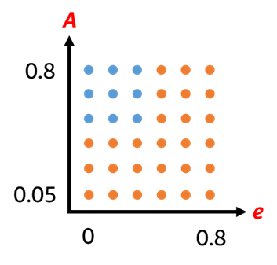
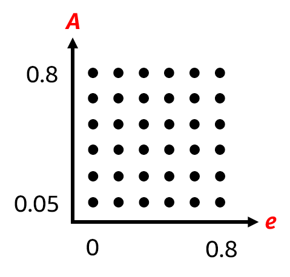

# Pengenalan
## Apa itu HITE?
**HITE (_Habitability Index for Transiting Exoplanets_) adalah** indeks/daftar yang mengurutkan eksoplanet berdasarkan probabilitas kelayakhunian/habitabilitasnya. Indeks ini disusun oleh Probabilitas ini didefinisikan sebagai kemungkinan planet tersebut: **a) mempunyai permukaan padat**, dan **b) memiliki air berfase cair di permukaannya**. 

:::{admonition} **Catatan tentang lisensi**
**HITE disusun oleh** [Rory Barnes](https://github.com/RoryBarnes/HITE) dari University of Washington. Program HITE dibagikan dengan lisensi GNU General Public License v3.0 yang memperbolehkan penggunaan dan perubahan terhadap program tersebut secara bebas. Info lebih lanjut tentang lisensinya bisa diperoleh [di sini](https://github.com/RoryBarnes/HITE/blob/master/LICENSE). Sesuai ketentuan lisensi tersebut, modifikasi dari program HITE ini juga dibagikan dengan lisensi yang sama.
:::

## Modifikasi
**Program yang cara kerjanya** akan dijelaskan di sini adalah HITE Termodifikasi/**_Modified HITE_** **(M-HITE)**. Berikut adalah modifikasi yang telah dilakukan terhadap program HITE sehingga menjadi M-HITE:
1) **program telah ditulis ulang**, dari C ke Python;
2) **besaran-besaran yang pada HITE orisinal dihitung** dari variabel observasi (seperti radius planet yang dihitung dari [transit]), pada M-HITE tidak dihitung, tetapi langsung diambil dari basis data [**exoplanets.org**](exoplanets.org). Hal ini memungkinkan M-HITE untuk mengevaluasi probabilitas kelayakhunian dari planet-planet yang ditemukan melalui metode lain selain metode transit;
3) **rentang parameter eksentrisitas orbit (_e_) dan albedo planet (_A_)** yang digunakan untuk menghitung probabilitas layak huni _H (e, A)_ tidak disamakan untuk semua planet, tapi diganti dengan rentang ketidakpastian _e_ dan _A_ masing-masing planet yang diambil dari  [exoplanets.org](exoplanets.org);
4) albedo
5) **eksentrisitas orbit yang ekstrem** dianggap menurunkan probabilitas kelayakhunian, sehingga planet dengan _e_ di atas angka tertentu (ditentukan oleh luminositas bintang inang) probabilitas layak huninya diberi penalti dan urutannya cederung turun dalam indeks;
6) zeng sasselov


## Daftar Isi
```{tableofcontents}
```





